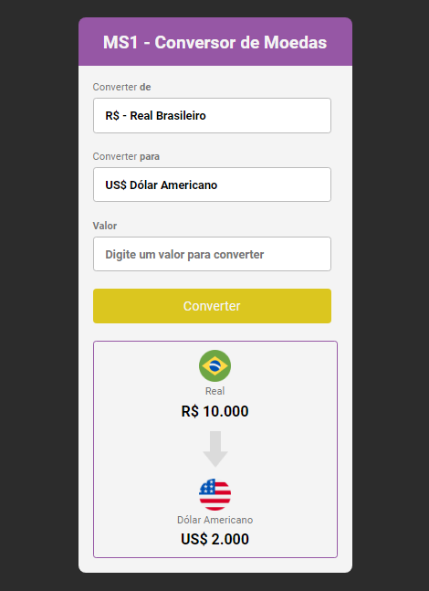

## Conversor de moedas

Neste projeto crio um conversor de moedas sendo entre os tipos de valores dólar, euro e real. Mas não apenas isso, também é utilizado uma API de Cotações de Moedas, onde conseguimos obter o valor em real do dólar e do euro em tempo real a cada 30 segundos!! Segundo o site: https://docs.awesomeapi.com.br/api-de-moedas.
Incrível não é mesmo???🙃🤗

**Observação:**  Preciso apenas corrigir o problema quando o usuário escolhe o valor desejado pra converter no campo de **valor**, pois caso ele digite algo que não seja um número como uma letra por exemplo, é exibido uma mensagem de alerta na tela pra ele "digite apenas números". Quem souber como posso resolver isso e contribuir com esse projetinho ficarei grato 😊😁!! 